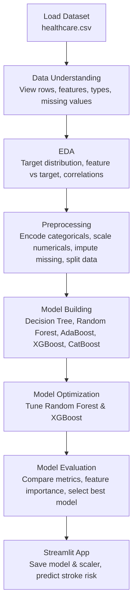

# Healthcare-Application
live link : https://healthcare-application.streamlit.app/

```mermaid
graph TD
    A[Load Dataset<br>healthcare.csv] --> B[Data Understanding<br>View rows, features, types, missing values]
    B --> C[EDA<br>Target distribution, feature vs target, correlations]
    C --> D[Preprocessing<br>Encode categoricals, scale numericals, impute missing, split data]
    D --> E[Model Building<br>Decision Tree, Random Forest, AdaBoost, XGBoost, CatBoost]
    E --> F[Model Optimization<br>Tune Random Forest & XGBoost]
    F --> G[Model Evaluation<br>Compare metrics, feature importance, select best model]
    G --> H[Streamlit App<br>Save model & scaler, predict stroke risk]


```
